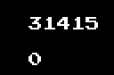

# pi_collisions

This program lets two blocks of different mass collide against eachother until their collisions compute the digits of pi.
It was inspired by a coding train video.

## Screenshots

## Algorithm

* Ellastic collision implementation for two blocks
* For higher mass, iterations are increased automatically, hence the poor fps with a mass of 100^7